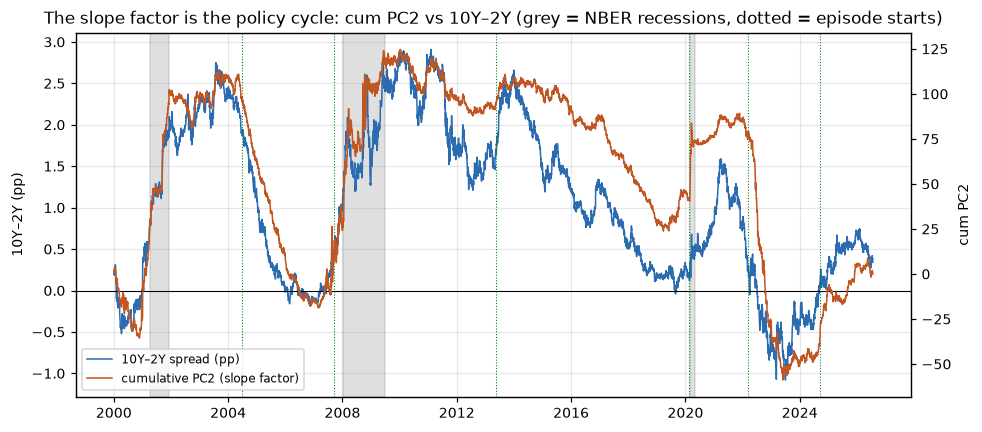

# What Drives the US Yield Curve?
### Level / slope / curvature factor analysis of 25 years of Fed policy and crises


**Stack:** Python, NumPy, pandas, statsmodels, scikit-learn, SQLite, matplotlib, pytest, GitHub Actions



Three risk factors drive almost everything the US Treasury curve does. This
project extracts them from scratch (hand-written eigendecomposition, no black
box) and uses them to re-read six famous macro episodes, from Greenspan's
conundrum to the 2022 inflation fight. It also tests a hypothesis I started
with and had to abandon: that crises compress the curve toward one dimension.
They don't. They rotate it.

## Motivation
Litterman & Scheinkman (1991) showed that ~95%+ of bond return variance is
explained by three factors. This is a conceptual replication of that
stylized fact, same phenomenon, different data (Δ par yields, 2000–present,
vs. their bond excess returns), plus questions they could not ask in 1991:
what do the factors say about each macro episode since, is the structure
stable, and what does it mean for hedging a real book?

## The three factors
`figures/02_loadings.png`, PC1 ≈ parallel level shifts (**71.8%** of
variance), PC2 ≈ slope / the policy cycle (**18.3%**), PC3 ≈ curvature
(**5.1%**). Economic validation: corr(PC1, mean Δy) = **0.999**;
corr(cumulative PC2, 10Y–2Y spread) = **0.897**.

## Reading 25 years of macro through the factors
`figures/05_episodes.png`, each episode's total curve move decomposed into
factor contributions on the covariance basis (bps units). Windows are
anchored *ex ante* to documented events (FOMC decisions, the Bernanke
testimony, the unlimited-QE announcement, see `src/config.py::EPISODES`),
never chosen from the chart; residual shares are reported for every episode.

| Episode | Regime | Factor signature |
|---|---|---|
| 2004–06 hikes | Bear flattening | PC1 +498 almost exactly cancelled by PC2 −498; long end barely moved |
| 2007–08 GFC | Bull steepening | PC1 −799, the largest level move in the sample; PC2 +451 |
| 2013 taper tantrum | Bear steepening | PC1 +162, PC2 +66, PC3 +45 — highest curvature share of the six |
| 2020 COVID | Level collapse | PC1 −285 in five weeks, with PC2 +175 alongside |
| 2022–23 inflation fight | Bear flattening | PC1 +688, PC2 −622; 537 straight days inverted |
| 2024– easing | Bear steepening | PC1 +184 with PC2 +136 — bear steepening, not the bull steepening I predicted |

## Does the structure hold still?
`figures/04_rolling.png`, 252-day rolling PCA with eigenvector alignment
(sign fixing plus PC2/PC3 swap detection: eigenvectors are only defined up to
sign, and up to rotation when eigenvalues nearly coincide).

I expected crises to squeeze the curve toward one dimension, with PC1 spiking
above 90%. That is well documented for cross-asset risk, but it does not hold
inside the Treasury curve. PC1 stays in a 70-83% band for the whole sample and
the highest reading lands in January 2002, not 2008 or 2020. Measured in basis
points the curve actually becomes more multi-dimensional in a crisis, because
the dominant move is the Fed slamming the front end while the long end sits
still, and that slope shock adds variance orthogonal to level.

So the three-factor structure is more stable than I assumed. What does break it
is not a crisis but the zero-rate era: from 2008 to 2017 PC1 explains only 63%
and the curvature factor sits 20.7 degrees off the full-sample one, because a
pinned front end stops moving altogether.

Overlapping windows make this series strongly autocorrelated, so it is
descriptive, not a significance test.

## Appendix

Five checks that back up the three findings above. Each is one module, run by
`python -m src.run_all --stages <name>`, and written up in
`notebooks/analysis.ipynb`.

- `hedging.py`: a duration-neutral 2s10s trade is immune to
  parallel shocks by construction but fully exposed to slope. A PC-hedge (two
  instruments, exposure orthogonal to PC1 and PC2) removes both, leaving only
  curvature risk. This is what the factor decomposition is for.
- `resampling.py`: a permutation test (shuffle each tenor's
  time order independently) puts the null EVR1 near 1/N ≈ 12.5%; the observed
  value lies entirely outside it. A block bootstrap gives a CI that respects
  autocorrelation.
- `sensitivity.py`: results re-run across tenor set, window
  length, subperiod, and correlation-vs-covariance basis. Where a claim doesn't
  survive, it's stated as a limitation.
- `nelson_siegel.py`: the Diebold-Li parametric model
  assumes the three shapes and fits them by OLS, sharing no machinery with PCA.
  Slope and curvature match at 0.83 and 0.79. Level only reaches 0.67, because
  NS forces a flat level loading while the empirical PC1 tilts toward longer
  maturities.
- `queries.py`: yearly summaries, longest inversion streaks (window
  functions), regime day-counts (LAG + CASE), computed inside SQLite.

## Data & design decisions
Eight constant-maturity tenors {3M…10Y} from FRED, 2000–present. 1M excluded
(starts 2001, money-market noise); 30Y excluded (discontinued 2002–2006).
**Missing days are dropped, not forward-filled.** Filling them injects
artificial zero-change days that shrink measured variance and distort the
correlation structure, which then distorts the eigenvectors. Dropping costs
4.1% of days. I ran it both ways and the explained-variance numbers came out
identical, because uniform zero rows only rescale the covariance matrix and
scaling does not rotate eigenvectors (details in `src/etl.py`).

## Method
Daily changes (ADF confirms levels are I(1), changes I(0)), then PCA via
`numpy.linalg.eigh` on both the correlation matrix (structure view, main
figures) and the covariance matrix (bps units, used for the event-study and
hedging decompositions), cross-checked against scikit-learn to ~1e-12. Every
module carries docstrings explaining the design decisions and the traps behind
them; the step-by-step narrative with results is in `notebooks/analysis.ipynb`;
unit tests
(20, covering PCA invariants, alignment, event decomposition, hedging
identities, resampling behaviour, and robustness checks) are in `tests/`.

## Limitations & outlook
PCA is a descriptive, real-world-measure (P) tool: no dynamics, no
no-arbitrage constraint, no pricing. The bridge to pricing is affine term
structure modelling under the risk-neutral measure Q (Vasicek, CIR), the
direction I aim to study formally next.

## Reproduce
```bash
pip install -r requirements.txt
export FRED_API_KEY=your_key        # free at fred.stlouisfed.org
python -m src.run_all               # fetch -> SQLite -> every figure and table
pytest -q                           # 20 tests, no network needed
```
`notebooks/analysis.ipynb` is the full narrative. It auto-detects: with
`FRED_API_KEY` set it fetches real data; without it, it runs on generated
3-factor data and labels every result as synthetic, so no fake number can be
quoted by accident. Individual sections: `python -m src.run_all --stages
core,events,rolling` (also `hedging`, `stats`, `nelson_siegel`,
`sensitivity`, `sql`).

## Repository structure
```
.
├── src/
│   ├── config.py          # tenors, dates, the 6 macro episodes (anchored, sourced)
│   ├── etl.py             # FRED fetch, validation, drop-not-ffill cleaning, SQLite
│   ├── pca_engine.py      # hand-written eigendecomposition, sign convention
│   ├── rolling.py         # rolling PCA + eigenvector alignment
│   ├── events.py          # episode decomposition (ex-ante windows + residual)
│   ├── hedging.py         # duration-hedge vs PC-hedge P&L
│   ├── resampling.py      # permutation test + block bootstrap
│   ├── sensitivity.py     # robustness: tenor / window / subperiod / basis
│   ├── nelson_siegel.py   # Diebold-Li model, cross-checked against PCA
│   ├── queries.py         # analytical SQL layer
│   ├── plots.py           # every figure
│   ├── synthetic.py       # 3-factor synthetic data for tests and offline runs
│   └── run_all.py         # single entrypoint, 8 selectable stages
├── notebooks/
│   └── analysis.ipynb     # full narrative in English
├── tests/                 # 20 pytest cases, no network needed
├── figures/               # generated plots and tables
└── requirements.txt
```

## References
- Litterman, R. & Scheinkman, J. (1991). *Common Factors Affecting Bond Returns.* Journal of Fixed Income.
- Diebold, F.X. & Li, C. (2006). *Forecasting the Term Structure of Government Bond Yields.* Journal of Econometrics.
- Lord, R. & Pelsser, A. (2007). *Level–Slope–Curvature, Fact or Artefact?* Applied Mathematical Finance.